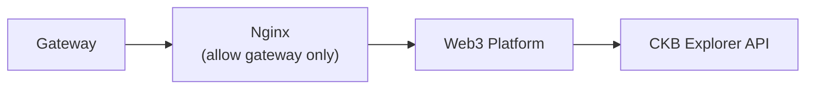

# CKB Explorer API Proxy

To proxy the CKB Explorer API, we need to set the `CKB_EXPLORER_API_PREFIX` environment variable to the CKB Explorer API endpoint, e.g.,
- Mainnet: `https://mainnet-api.explorer.nervos.org/api`
- Testnet: `https://testnet-api.explorer.nervos.org/api`

## Working with Gateway

